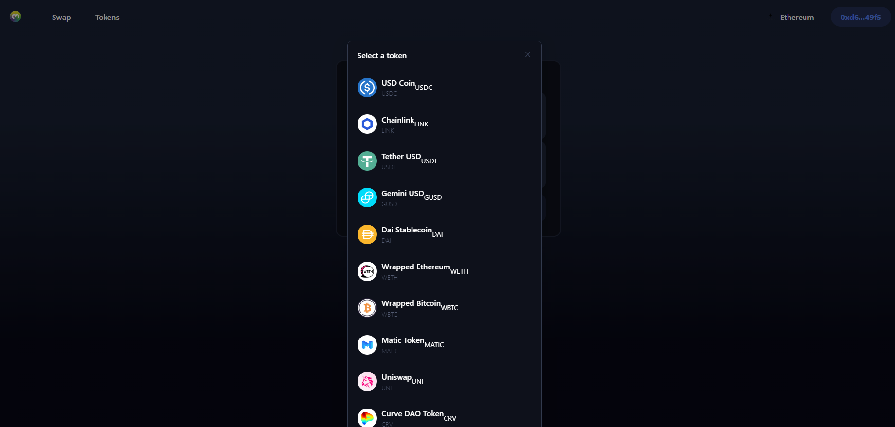

# Dex Starter

This is the Simple Dex app (Dapp).

# Stages of project.
    1. Project Setup.
    2. Build a DEX Header.
    3. Create a DEX by Building a Swap Page.
    4. Implementing Backend DEX Functionality.
    5. Interacting with the 1inch Aggregator.

